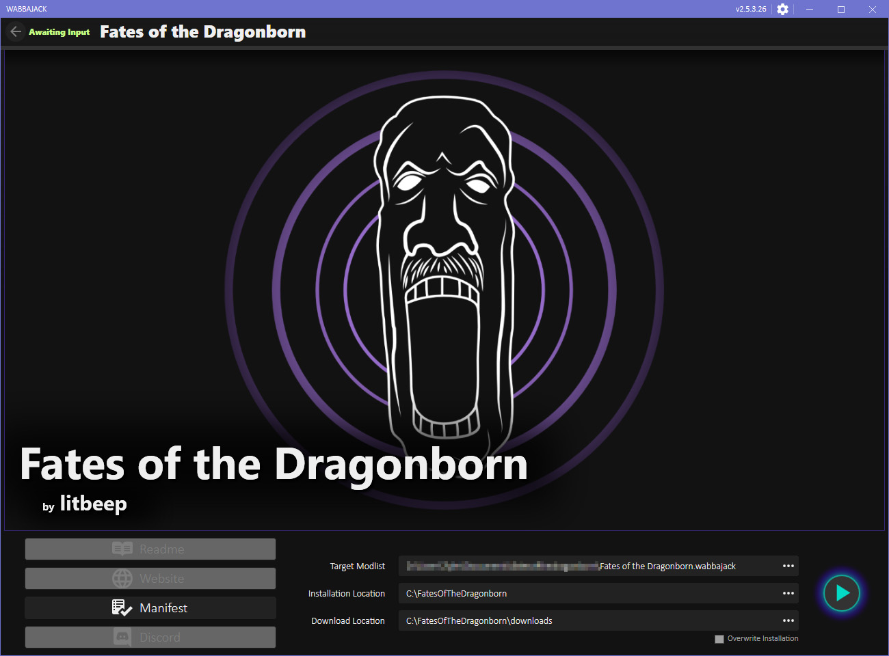
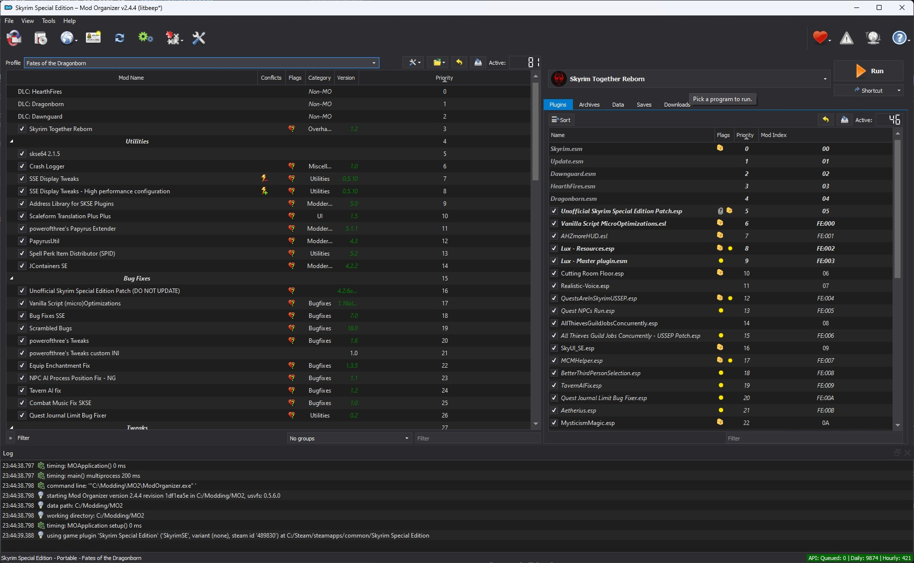
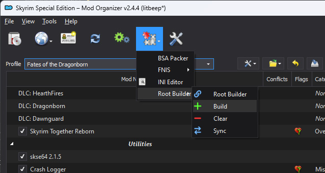
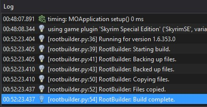
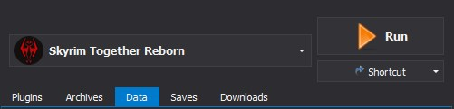

# Fates of the Dragonborn
## Introduction

Fates of the Dragonborn is a modlist intended to combine A Dragonborn's Fate with Skyrim Together Reborn, with a few extras thrown in. Some mods from ADF are excluded due to incompatibilities. Root Builder is used and included.

Below, you will find detailed instructions on how to prepare and install this modlist. Please follow all directions to the letter. 

(The majority of this guide is shamelessly copied from [Tilted Online](https://wiki.tiltedphoques.com/tilted-online/), [A Dragonborn's Fate](https://dragonbornsfate.github.io/), and [Wasteland Survival Guide](https://wastelandsurvivalguide.com/))

## Requirements

* A legal copy of The Elder Scrolls V: Skyrim Special Edition on Steam, at least version 1.6.XX. No, it doesn't work with anything below v1.6.XX.
* Only the English version of the game is supported for maximum compatibility. Bethesda.net, Xbox Game Pass, and pirated versions of the game are also unsupported, as they do not work with SKSE which is essential for many mods.
* This modlist is tailored for the basic version of the game. Creation Club content will not be used. If you have CC content, this readme will instruct you on what to do.
* At least 15 GB of free drive space
* Windows 10 21H2 or higher (64bit)
* **[Visual C++ Runtime Libraries](https://www.techpowerup.com/download/visual-c-redistributable-runtime-package-all-in-one/)**
* Extract the above archive and **run the included install_all.bat as an administrator** to install all of the required libraries at once
* An archiving tool (I recommend **[7-Zip](https://www.7-zip.org/)**)
* The latest GPU drivers (Either NVIDIA, AMD or Intel)
* A **[Nexus Mods](https://users.nexusmods.com/register)** account

## What the heck is Root Builder?

This Mod Organizer 2 plugin will allow you to install mods such as SKSE in MO2, this way the game folder will never need any modification and you will be able to track all newly generated files.

Root Builder by default (This is also the best mode for compatibility) works by copying files to the root folder when **building** and removing those files when **clearing**.

### How does it keep my root folder clean?

When you build for the first time in this guide, Root Builder will cache all the hashes of your game root files (Except the Data folder because MO2 handles it). This way when you want to revert your root folder to a clean state, the plugin will know what the original folder looked like.

### Tracking newly generated files

When you clear, Root Builder will revert all your base files via hashes and the backup it stored. Any file that belongs to a mod in MO2 will simply be removed from root, ready for another build in the future. But what happens to files that popped up in your game folder between the first build and this clear?

Let's say for example that you have a new .log file in your root folder, and this file is not part of the base game root folder nor any mod in MO2. Upon clearing this will be sent to your overwrite folder in MO2, effectively letting you track any file created by your mods while the game is running.

# Part I - Prep Work
## Uninstalling the game
Perhaps you haven't even installed Skyrim Special Edition (SkyrimSE), but we'll need to double-check.

Begin by uninstalling your game from the Steam application:

1. Open Steam
2. Find ``The Elder Scrolls V: Skyrim Special Edition``
3. Right click and select ``Manage -> Uninstall``
4. Find your Skyrim installation folder. That can vary, but it may be located at ``C:\Program Files (x86)\Steam\steamapps\common\Skyrim Special Edition``
5. Delete the entire ``Skyrim Special Edition`` folder.

## Removing old game profile(s) and savegames
Even if you haven't installed Skyrim Special Edition, let's make sure to empty the folder containing all of your config files and savegames. Back- up your saves and return them to the folder afterwards, if you care about them.

1. Go to your ``Documents`` folder.
2. Find your ``My Games`` folder.
3. Delete the ``Skyrim Special Edition`` folder.

If you do not have this folder, move on to **Installing Wabbajack**.

## Downloading Wabbajack

1. Navigate to **[wabbajack.org](https://www.wabbajack.org/)** and click ``Download``

2. Create a folder a ``Wabbajack`` folder at the root of your ``C:\`` Drive

3. Move the downloaded ``Wabbajack.exe`` to the ``C:\Wabbajack`` folder

# Part II - The Clean Install
## Installing SkyrimSE
Now we'll install SkyrimSE from scratch.

1. Open Steam
2. Find ``The Elder Scrolls V: Skyrim Special Edition``
3. Right-click and press ``Install``.
4. Follow the instructions on screen (literally just press Next)
5. Press ``Finish`` and wait for your download to complete

## Making sure Anniversary Upgrade DLC is disabled
Making sure the Anniversary Upgrade DLC is turned off is a critical step. You may not have purchased it, but it is best to double-check that it is not present:

1. Open Steam and head to your library.
2. Find ``The Elder Scrolls V: Skyrim Special Edition``
3. Right-click and select ``Properties``
4. Go to ``DLC`` and remove the ``✓`` from the ``The Elder Scrolls V: Skyrim Anniversary Upgrade DLC``.
5. If you don't see a DLC tab, it means you didn't buy the ``The Elder Scrolls V: Skyrim Anniversary Upgrade`` DLC.

	

**This is a necessary step because Skyrim Together Reborn does not function properly with the Anniversary Upgrade DLC enabled.**

## Launching the game from Steam
**⚠️Please do not skip this step!⚠️**

Next, we must launch the game normally from Steam in order for it to generate some configuration files for us. Fortunately, this is a very simple procedure.

1. Open Steam and head to your library.
2. Find ``The Elder Scrolls V: Skyrim Special Edition``
3. Right-click and select ``Launch``
4. The SkyrimSE launcher will open and popup with some detection mechanism that should detect your system and set graphic options accordingly.
5. However, depending on your hardware, it may  identify everything incorrectly and set everything to "Low Quality" and a incorrect resolution.
6. To correct this, go to ``Options`` and select ``Windowed`` and ``Borderless`` to change your resolution.
7. Configure the rest of the settings to your preferences.

8. Now press ``Play`` and **EXIT THE GAME** after it has opened into the main menu.

Now, onto the installation of the mod list!

# Part III - Fates of the Dragonborn Installation

1. Create a folder on the root of your ``C:\`` drive and name it ``FatesOfTheDragonborn``.
2. Enter the ``C:\FatesOfTheDragonborn`` folder and create a new folder, naming it ``downloads``.
3. Download the **[latest release](https://github.com/litbeep/fatesofthedragonborn/releases)** of this modlist and extract it anywhere.
4. Run the ``Fates of the Dragonborn.wabbajack`` file using ``C:\Wabbajack\Wabbajack.exe``.
5. Under ``Installation Location``, navigate to the ``C:\FatesOfTheDragonborn`` folder created earlier and select it.
6. Under ``Download Location``, navigate to the ``C:\FatesOfTheDragonborn\downloads`` folder and select it.

**Hopefully, this is how your configuration of Wabbajack should look.**

7. Hit the start button, and Wabbajack will then automatically download and install Mod Organizer 2 to the folder you chose, along with the Rootbuilder plugin and all necessary mods.

8. Once installation has finished, open the folder and run ``ModOrganizer.exe``. It may take a few moments before you see anything happen. Eventually, the program will open, and may prompt you to locate the folder in which SkyrimSE is installed.

**At long last, you'll see the Mod Organizer interface with all of the mods present. But we're not done quite yet.**

## Removing the included Creation Club content

ℹ️ When Bethesda released the Anniversary Upgrade DLC, the game version was updated to v1.6.
Whether you bought the DLC or not, Bethesda included four Creation Club items with the update.
These four CC items have been shown to make the Skyrim Together Reborn experience more unstable, and prone to crashing more frequently.

⚠️ If you remove the Creation Club content, your existing savegame(s) may become unloadable.
Regardless, it is **strongly advised** that they be removed!

This guide will demonstrate how to remove the included CC content using MO2.

1. Close out of Mod Organizer 2.

4. Next, navigate to your ``Skyrim Special Edition`` install directory and enter the ``Data`` folder

5. Find these files:

- ccBGSSSE001-Fish.bsa
- ccBGSSSE001-Fish.esm
- ccBGSSSE025-AdvDSGS.bsa
- ccBGSSSE025-AdvDSGS.esm
- ccBGSSSE037-Curios.bsa
- ccBGSSSE037-Curios.esl
- ccQDRSSE001-SurvivalMode.bsa
- ccQDRSSE001-SurvivalMode.esl

6. Delete them.

7. Re-open Mod Organizer 2, and the Creation Club content will not be listed anymore.

## Final Steps

9. Close out of Mod Organizer 2.

10. Download the **[Custom INI](https://github.com/litbeep/fatesofthedragonborn/blob/main/files/Custom%20INI.7z)**.

11. Head over to your ``Documents`` folder in file explorer, then open this path ``My Games\Skyrim Special Edition``

12. Download and extract the archive, then paste ``SkyrimCustom.ini`` next to the other INIs

13. Open Mod Organizer 2 once more.

14. Go to ``Tools`` -> ``Root Builder`` -> ``Build``

15. Your log should now say that the build was complete.

16. Launch the game by ensuring ``Skyrim Together Reborn`` is selected and click ``Run``!

# Final Notes

* Auto-saving is disabled for stability reasons. Try to avoid quick-saving and make full saves instead.
* Use BethINI at your own discretion.